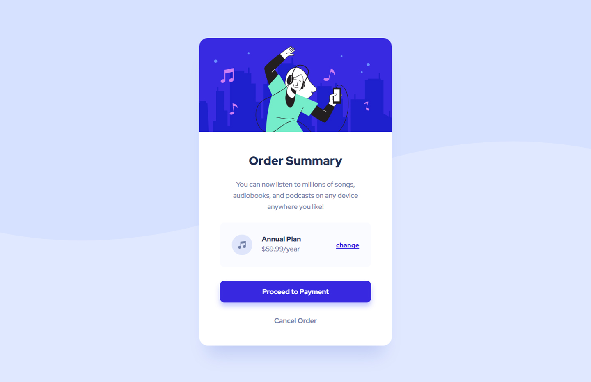

# Frontend Mentor - Order summary card solution

This is a solution to the [Order summary card challenge on Frontend Mentor](https://www.frontendmentor.io/challenges/order-summary-component-QlPmajDUj). Frontend Mentor challenges help you improve your coding skills by building realistic projects. 

## Table of contents

- [Overview](#overview)
  - [The challenge](#the-challenge)
  - [Screenshot](#screenshot)
  - [Links](#links)
- [My process](#my-process)
  - [Built with](#built-with)
  - [What I learned](#what-i-learned)
  - [Useful resources](#useful-resources)
- [Author](#author)

## Overview

### The challenge

Users should be able to:

- See hover states for interactive elements

### Screenshot

### Links

- Solution URL: [Frontend Mentor Solution](https://www.frontendmentor.io/solutions/order-summary-component-pure-html-css-and-custom-active-hover-states-SJwF6N9Lc)
- Live Site URL: [Live Site at Vercel](https://order-summary-component-eight-rho.vercel.app/)
## My process

### Built with

- Semantic HTML5 markup
- CSS custom properties
- Flexbox
- Responsive Design
- Custom hover states

### What I learned

I learned how to create a clean code, in my first attempt I used some useless divs, I tried my best to don't write useless tags. This challenge was really good to have an idea about how to wrap sections, 
prepare the website for mobile setting some breakup points and changing the way the elements are disposed as it stretch. Some cool stuff I added to my code was some custom hover states. 
I finally discoved how to create smooth transitions from the static element and hover element, this is a simple thing, but I have no idea how it was done until today.

### Useful resources

- [Flexbox Froggy](https://flexboxfroggy.com/) - Here I play small challenges about flexbox
- [CSS Zoom on Hover](https://codepen.io/lucy_wheel/pen/VxYzKP) - Here I got some info about the zoom on hover that I applied in my design

## Author
- Github - [correlucas](https://github.com/correlucas/order-summary-component)
- Frontend Mentor - [@correlucas](https://www.frontendmentor.io/profile/correlucas)

